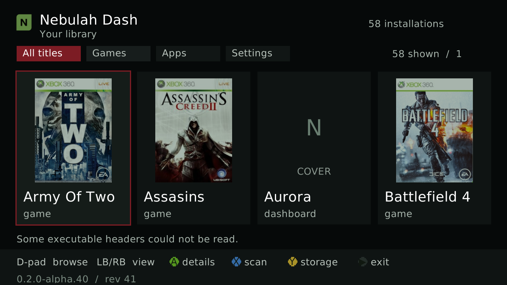

# Nebulah Dash

A controller-driven Xbox 360 dashboard for RGH/JTAG consoles. Browse installed games and apps, view cover art, open details, and launch a selected title.

*Real console capture from revision 41. The current development build is revision 43; its library layout is similar.*

## Where the project stands

**In development: `0.2.0-alpha.42` / revision 43. No stable release or public XEX yet.** This repository holds the public project summary. Development source and console test records live in the private core.

On the reference console, the dashboard displayed 58 installations and cover cards. Targeted checks passed for controller browsing, Settings, rescan, storage review, and returning to the configured dashboard. Earlier builds launched Aurora and COD4 in targeted tests.

Revision 43 can save the **Auto-load covers** choice beside its XEX. The Off setting survived a relaunch on the reference console. [Nebulah Link](https://github.com/Nebulah360/Nebulah-Web-App) can copy cached covers to a selected Dash folder; a newly missing cover and longer-running stability still need console tests.

## Still in development

- Durable storage enrollment and normal persistent library writes.
- Direct network metadata and cover downloads from the Dash.
- Runtime plugin management and broader native crash recovery.
- Long-duration and wider hardware compatibility checks.

The revision 43 RXDK Release XEX was built from private source `91975931cd7248d074fe878e31f4dda30fb6d830` with SHA-256 `08a036fc3e2e4a7621d76a0235b459331621e92088e1f0d008b4bb1cd9d05421`. That artifact was inspected and launched on the reference console. This is targeted test evidence, not a stable release or a safety guarantee.

See [Nebulah Link](https://github.com/Nebulah360/Nebulah-Web-App) for the separate Windows and phone companion. Reviewed, hardware-tested Dash milestones will be published here when ready. No proprietary SDK files, console secrets, game files, or XEX binaries are included.